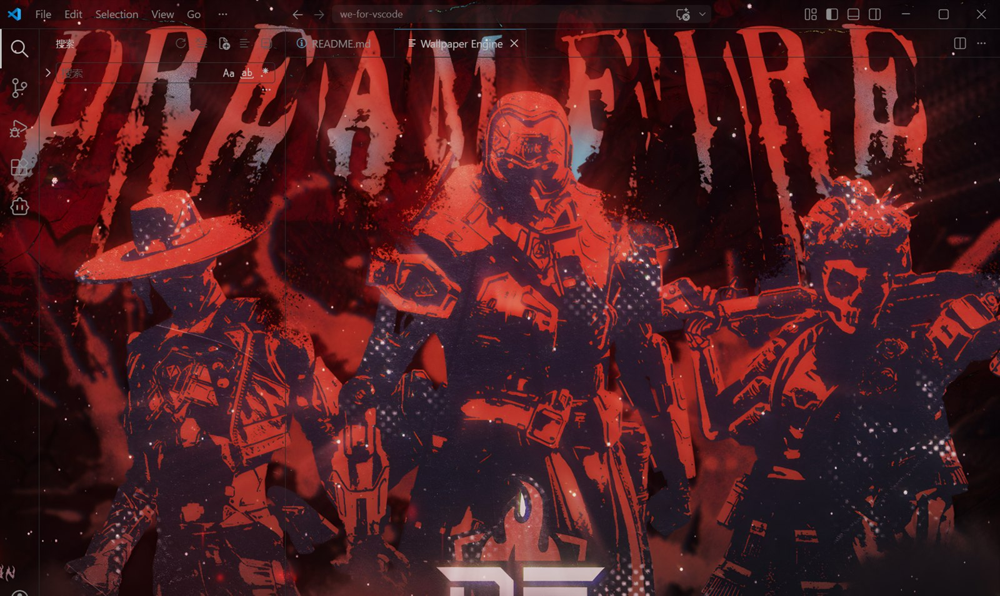
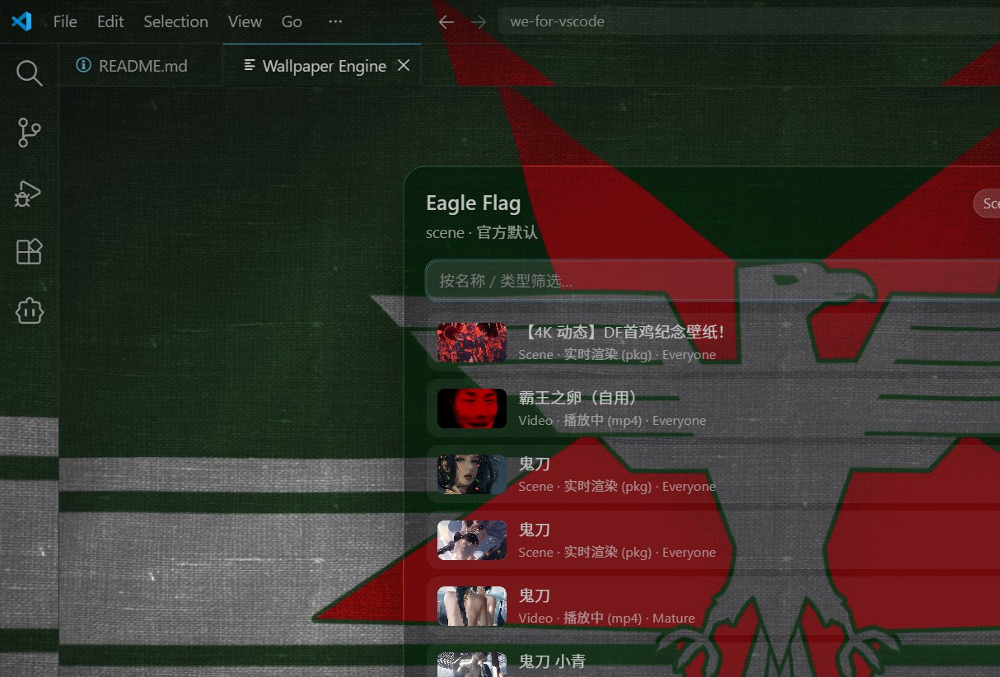

# Wallpaper Engine for VS Code

Render your **local Wallpaper Engine wallpapers** inside VS Code: a liquid-glass wallpaper view (the panel), and optionally the wallpaper **behind the entire window** — the whole UI floating on top of it.

Unlike the "swap in a static background image" extensions, this one **actually runs your wallpapers**:

- **Reads the Wallpaper Engine library already installed on your PC** (all 36 Steam Workshop items in one scan — no export, no upload);
- **Video, Scene and Web wallpapers**; Scene and Web are **rendered live** by a WebGL engine, not shown as a preview still;
- **Whole-window mode** is tuned as a background layer (1 canvas pixel per CSS pixel, 24 fps) and renders each wallpaper **once**;
- **Frosted glass** across the sidebar, title bar, status bar, terminal panel, dropdown menus and the command palette — while the **code area stays sharp, never blurred**;
- **Automatic readability**: the wallpaper layer measures its own pixels and solves the code surface's opacity to WCAG 4.5:1 (measured 1.49:1 → 4.52:1), and can be switched off so the sliders are the truth.

> 中文版: [README.md](README.md)





---

## Table of contents

- [What it does](#what-it-does)
- [Install](#install)
- [Usage](#usage)
- [Settings](#settings)
- [How it works](#how-it-works)
- [Known limitations](#known-limitations)
- [Troubleshooting](#troubleshooting)
- [Development](#development)
- [Licence and credits](#licence-and-credits)

## What it does

- **Automatic library discovery**
  - Wallpaper Engine install directory: registry `HKCU\Software\Valve\Steam` → common locations → WSL `/mnt/*`;
  - Workshop content (appid `431960`) plus `projects/defaultprojects` and `projects/myprojects`.

- **Four rendering paths**, chosen from each project's `project.json` `type` and its main file:

  | Type | Rendering | Notes |
  |---|---|---|
  | Video | `<video>` playback | mp4 / webm and friends |
  | Scene | **live** (WebGL) | packed `scene.pkg` or loose `scene.json` source form |
  | Web | **live** (web page) | HTML-entry web wallpapers |
  | Anything else (Application, HTML-less Web, Scene whose main file is neither pkg nor json) | preview image | Application wallpapers are never executed |

- **Two surfaces, one selection**
  1. **Wallpaper view (panel)** — a webview the wallpaper fills, with the glass control panel on top;
  2. **Whole-window background layer (experimental)** — the wallpaper fills the entire VS Code window, with the editor, side bar and status bar floating above it.

- **Wallpaper selection inside the panel.** `选择壁纸…` expands the library right there: a search box plus a thumbnail list; one click swaps the wallpaper and the list stays open so you can click through them. No command palette, nothing over the window's top bar.

- **Liquid-glass controls**: blur, saturation, glass tint and opacity, panel width, border, scrim, wallpaper opacity.

- **Transparent title bar**: one switch sets `window.titleBarStyle`, `window.controlsStyle` and the title bar colours to the recipe that can actually be transparent (your original values are restored when you turn it off).

- Multiple windows, pause when unfocused/occluded, and slideshow rotation (`autoRotateSeconds`, Video only).

## Install

**Requirements**: Windows; Wallpaper Engine installed on the same machine; VS Code ≥ 1.90.

### From the release VSIX

```powershell
# Close VS Code completely first: the whole-window layer is a file-level patch to the
# installation, and installing while VS Code runs leaves the webview with a
# "Could not register service worker" error.
& "$env:LOCALAPPDATA\Programs\Microsoft VS Code\bin\code.cmd" `
  --install-extension .\we-for-vscode-0.1.16.vsix --force   # match the filename in the release
```

Start VS Code afterwards: the extension activates on startup, and `Ctrl+Alt+W` opens the wallpaper view.

### From source

```powershell
git clone https://github.com/Y1X1n/we-for-vscode.git
cd we-for-vscode
npm install
npm run verify                        # tsc + node --test
npx vsce package --no-dependencies    # produces we-for-vscode-<version>.vsix (version from package.json)
```

### Turning on "fill the whole window"

It is off by default because it patches `workbench.html` inside the VS Code installation (see [How it works](#how-it-works)):

1. Open the wallpaper view (`Ctrl+Alt+W`) and pick a wallpaper;
2. Run **Wallpaper Engine: 启用壁纸背景（铺满 VS Code，实验/需改安装目录）** from the command palette, or flip `weWallpaper.workbenchBackground`;
3. Follow the prompt: the **first** patch (or the first one after a VS Code update wiped it) needs a **full quit and relaunch** — the installation checksum table is read once, at startup, so a window reload cannot clear the "installation appears to be corrupt" notice. When only the injected assets changed, reloading the window is enough (each other open window needs its own `Ctrl+R`; newly opened windows pick it up automatically).

To undo: run **禁用壁纸背景（还原安装目录）** — the installation goes back to how it was.

## Usage

| Command | What it does |
|---|---|
| `Wallpaper Engine: 打开壁纸视图` (`Ctrl+Alt+W`) | Opens the panel |
| `Wallpaper Engine: 选择壁纸…` | Opens the panel with its wallpaper library expanded (selection stays in the panel; filter by type / tag / source / rating, or search by name) |
| `Wallpaper Engine: 下一张壁纸` | Next playable wallpaper |
| `Wallpaper Engine: 重新扫描壁纸库` | Forced rescan (also drops the Steam location cache) |
| `Wallpaper Engine: 启用/禁用壁纸背景` | Whole-window layer on/off (patches or restores the installation) |
| `Wallpaper Engine: 诊断：壁纸背景状态` | Patch state, checksum consistency, which window owns the media port, how many windows loaded the patch |

The panel has three buttons: `pause/play`, `选择壁纸…` (expand/collapse the library), `下一张`. The status bar keeps the current wallpaper's name and turns into **壁纸资源待重载** after an update — click it to reload.

## Settings

| Setting | Default | Meaning |
|---|---|---|
| `weWallpaper.wallpaperId` | `""` | Selected wallpaper id; empty = first playable. Picking in the panel writes it back |
| `weWallpaper.steamRoot` | `""` | Manual Steam root(s), `;`-separated |
| `weWallpaper.mediaPort` | `39127` | Local media server port (loopback only). Port and token have to stay stable |
| `weWallpaper.blur` | `16` | Glass blur radius in px (0–60) |
| `weWallpaper.saturate` | `1.3` | Glass background saturation |
| `weWallpaper.glassAlpha` | `0.45` | Glass tint opacity (raised by the readability floor) |
| `weWallpaper.glassColor` | `#101014` | Glass tint |
| `weWallpaper.panelWidth` | `420` | Panel width in px |
| `weWallpaper.border` | `1` | Glass border width in px |
| `weWallpaper.scrim` | `0.35` | Dimming layer strength above the wallpaper |
| `weWallpaper.wallpaperOpacity` | `1` | Wallpaper layer opacity |
| `weWallpaper.pauseWhenHidden` | `true` | Pause when the panel is hidden or the window loses focus |
| `weWallpaper.autoRotateSeconds` | `0` | Slideshow interval (0 = off, Video only) |
| `weWallpaper.workbenchBackground` | `false` | **Experimental**: wallpaper behind the whole window (patches the installation, reversible) |
| `weWallpaper.workbenchOpacity` | `1` | Whole-window layer opacity |
| `weWallpaper.workbenchScrim` | `0.35` | Whole-window dimming |
| `weWallpaper.workbenchLiveScene` | `false` | **Experimental**: render Scene **and Web** wallpapers live in the whole-window layer (off = preview image only). That layer renders tuned for a background (`renderDpr` 1 = one canvas pixel per CSS pixel, ≈0.44× the pixels; 24 fps; `medium` particles); the panel keeps full quality |
| `weWallpaper.liveSurface` | `workbench` | **Which surface renders a Scene/Web wallpaper live**: `workbench` (default: the whole-window layer renders and the transparent panel shows it through) / `panel` (the reverse) / `both` (old behaviour — renders the same wallpaper twice) |
| `weWallpaper.transparentTitleBar` | `false` | Transparent title bar and window buttons |
| `weWallpaper.logLevel` | `warn` | Level of the "Wallpaper Engine" output channel (use `info` when debugging) |

## How it works

### The panel (what the official API allows)

The panel is an ordinary webview the extension fully controls: the wallpaper fills it, the glass panel floats on top.

- The engine (`webwallgl`, see below) is imported **same-origin**, so the panel holds the `SceneInstance` directly and can `pause/resume` it or grab a frame with `canvas.toDataURL()`;
- Scene and Web ride the **same** path: `httpSource(<project directory token>)`, and the engine reads `project.json` to branch on `type`;
- The media server listens on `127.0.0.1` only and addresses content by unguessable tokens:
  - `/m/<token>` for a single file (video, preview image);
  - `/wallpaper-engine/scene-files/<token>/<relative path>` for a whole project directory, so a scene's relative textures/materials and a web wallpaper's css/js resolve exactly as they do in Wallpaper Engine.

### The whole-window background layer

VS Code has no API for "hand the window background to an extension", so this layer is a **file-level patch**: a small static block injected into the installation's `workbench.html`, plus a few side files next to it.

The load-bearing constraint: **`workbench.html` is checksummed** (`product.json` carries its SHA-256; corrupt it and VS Code shows "Installation appears to be corrupt. Please reinstall."). Therefore:

- the injected block **never changes** and references a version-less `we-workbench-boot.js` (the loader);
- the loader reads a content hash from `we-workbench-assets.json` at boot and fetches the current css / core script as `<file>?v=<hash>` — so **an extension update never rewrites the HTML**;
- patching syncs `product.json`'s checksum entry, computed from the bytes actually on disk, so the integrity check stays green;
- patching and stripping are **byte-exact inverses** (`stripPatch(injectPatch(x)) === x`, pinned by a test; *disable* restores the installation).

Live Scene/Web rendering in that layer each had their own wall, and the measured conclusions live in the source comments:

- **Scene**: the engine is imported from a **blob URL** (the workbench CSP allows `script-src blob:` but not the loopback origin as a script source), and the container is given layout space with `visibility:hidden` before mounting — otherwise the engine measures a 0×0 CSS box and the canvas never becomes visible.
- **Web**: a web wallpaper's author page has to live in a sandboxed iframe, and the workbench CSP's `frame-src` allows neither `blob:` nor the loopback origin. The way out is a **same-origin stub page** (`we-workbench-web.html` + `.js`, allowed by `frame-src 'self'`): it fetches the engine as text, imports it from a blob URL, and lets the engine mount the author app; the author iframe is then re-sandboxed to an opaque origin so wallpaper code cannot reach VS Code's DOM. Neither path widens the workbench CSP.

### The engine

Live rendering is done by **`webwallgl@2.1.0` (MIT)**, shipped with the extension under [`media/webwallgl/`](media/webwallgl/) (with its `LICENSE` and `UPSTREAM.json`). The panel imports it same-origin; the whole-window layer imports it from a blob URL.

The deeper field notes (per-directive CSP matching, `makeOpaque()` versus Electron's native window buttons, Trusted Types, multi-window port takeover, …) are in [`docs/ENGINEERING-NOTES.zh.md`](docs/ENGINEERING-NOTES.zh.md) (Chinese).

### Performance

Live rendering runs on the **window renderer's main thread** — the same one the editor UI runs on — so what it costs is not only battery, it is whether typing stays responsive. How these numbers were taken: attribute CPU per Electron process role (`renderer` / `gpu-process` / `extensionHost`) instead of summing every `Code.exe`, and sample **A/B/A/B** rather than A-then-B (this machine's noise band is ±5–8% of one core, enough to invert a conclusion).

| Configuration (panel closed, 150% scaling, a light Scene) | CPU (one core = 100%) |
|---|---|
| Whole-window layer showing the still (preview GIF) | 27.5 / 27.9 |
| The same wallpaper rendered live | 31.4 / 32.2 → **≈ +4% per live instance** |
| Heavy scene (32 layers, 4K) × a second instance | 40.0 → 44.4 → **+4.4% again** |
| Both surfaces live, window minimized | **3.0** (42.4 while visible) → nothing burns in the background |

That is why two defaults exist:

- **The whole-window layer renders tuned for a background**: `renderDpr` 1 — the canvas drops from the device pixel ratio (1839×1239 here) to one pixel per CSS pixel (1226×826), ≈0.44× the pixels, and the remaining 1.5× upscale on a 150% display is invisible behind the UI — plus 24 fps and `medium` particles. The panel keeps full quality.
  (`0.5` was tried first: a 613×413 canvas, 9× fewer pixels, visibly soft in a screenshot and too risky for Web wallpapers with text/UI.)
- **One wallpaper is rendered once by default** (`weWallpaper.liveSurface = workbench`): dropping the second engine instance halves the main-thread pressure. And because the panel itself is transparent, it simply **shows the whole-window layer's live wallpaper through** — nothing looks degraded, there is just one render. Switching to `panel` or `both` is one setting away, you just pay for it.

## Known limitations

- **A proof of concept**: APIs, setting names and internals may change.
- **Application wallpapers are never executed** (upstream's stance).
- Web wallpapers whose entry is not HTML, and Scenes whose main file is neither `scene.pkg` nor `scene.json`, **degrade to their preview image** instead of pretending.
- After patching, **every already-open window needs one reload**; newly opened windows pick it up automatically.
- With several windows open, **only the one that bound the media port** answers `/current`; the others take the port over when it exits.
- `window.controlsStyle` is read when a window is created, so the transparent title bar needs a **full restart** (`Ctrl+R` is not enough).
- The whole-window layer is a full-screen animated surface and can trigger compositing artifacts (code-line residue and friends); turn `workbenchLiveScene` (or sticky scroll) off if you see them.

## Troubleshooting

| Symptom | Cause / fix |
|---|---|
| Status bar shows **壁纸资源待重载** | The extension was just updated: click it to reload (`Ctrl+R` in every other window) |
| A one-off **"Installation appears to be corrupt. Please reinstall."** | `workbench.html` was rewritten during this session (e.g. re-injected automatically after a VS Code update). **Quit VS Code completely and reopen it**; *disable workbench background* also restores the installation |
| The webview reports **Could not register service worker** after an update | Installing while VS Code runs; close VS Code completely and reopen |
| A Scene/Web wallpaper shows only a blurry still behind the window | `weWallpaper.workbenchLiveScene` is off (the default) — turn it on |
| The panel shows nothing and the log is silent | Set `weWallpaper.logLevel` to `info`; the "Wallpaper Engine" output channel then reports the mount steps and the engine's own diagnostics |
| The title bar / window buttons stay opaque | When Windows draws the title bar, no CSS can reach it; enable `weWallpaper.transparentTitleBar` (it switches `titleBarStyle`/`controlsStyle` to `custom` and needs a full restart) |

## Development

```powershell
npm install
npm run verify     # tsc -p . + node --test (105 tests today)
```

The tests cover the contracts that only break when you actually run it: byte-exact patch round trip on the real `workbench.html`, checksum encoding matching the vendor's own `product.json` table, "an extension update never moves the HTML", the CSP being widened only where a media element needs it, every element id the webview reaches for existing, the panel ⇄ host message contract, and the preconditions of mounting Scene/Web in the whole-window layer.

`tools/` contains two **replica environments with the real workbench CSP** (`require-trusted-types-for 'script'` included) that run the whole-window mount path in headless Edge/Chrome and report its lifecycle:

```powershell
npm run compile
node tools/check-workbench-scene.mjs 1   # scene: blob import + mount + frame grab
node tools/check-workbench-web.mjs 0     # web: same-origin stub + engine + author frames
```

Both need a Wallpaper Engine library on the machine. Packaging:

```powershell
npx vsce package --no-dependencies
```

## Licence and credits

This project is **MIT** — see [LICENSE](LICENSE).

- **`elysia395/dsh-wallpaper-engine` (MIT)**: this extension is a port of it to VS Code; library discovery, the glass parameter vocabulary and plenty of the measured findings come from upstream.
- **`oneincase/webwallgl@2.1.0` (MIT)**: the Scene/Web live-rendering engine, shipped with the extension (`media/webwallgl/`).
- **`vscode-background`, `GlassIt-VSC`, `vscode-custom-ui-style`**: the whole-window layer and the "make the UI transparent" technique were informed by them.

Wallpaper Engine and every wallpaper belong to their respective authors; this extension only reads the wallpaper files on your machine and uploads nothing.
